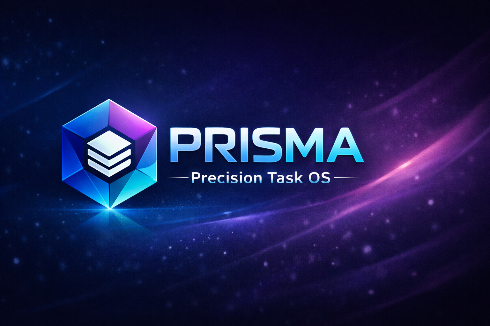

# PRISMA – Precision Task OS

---

## 📌 Overview

PRISMA is a modern, gamified productivity operating system built entirely with frontend technologies.  

Instead of traditional to-do lists, PRISMA turns tasks into **missions**, tracks performance in real time, and delivers measurable productivity metrics through a clean, immersive UI.

---

## 🖼 Screenshots



---

## 🚀 Features

- 🎯 Mission-based task system  
- 📊 Real-time Efficiency Tracking  
- 🏆 Dynamic Vibe Score Engine  
- 🌙 Dark / ☀ Light Mode Toggle  
- 🧘 Zen Focus Mode  
- 📁 LocalStorage Data Persistence  
- 📤 One-click Report Export  
- ✨ Animated Particle Background  
- 📱 Fully Responsive Design  

---

## 🧮 Productivity Engine

PRISMA calculates performance using structured formulas:

### Efficiency

\[
Efficiency = \frac{Completed}{Total} \times 100
\]

### Score System

\[
Score = (Completed \times 50) + (Total \times 10)
\]

This makes productivity measurable and motivating.

---

## 🏗 Project Structure

```
PRISMA/
│
├── assets/
│   └── logo
│
├── index.html
├── style.css
├── script.js
└── README.md
```

---

## 🛠 Tech Stack

- **HTML5**
- **Tailwind CSS**
- **Vanilla JavaScript**
- **LocalStorage API**
- **Canvas API**

Everything runs 100% client-side.

---

## ⚙ How It Works

- Tasks are stored locally using `localStorage`
- UI updates dynamically via JavaScript
- Score & efficiency recalculate automatically
- Theme preference persists between sessions
- All animations run using lightweight Canvas rendering

No backend required.

---

## 📦 Installation

Clone the repository:

```bash
git clone https://github.com/your-username/prisma.git
```

Navigate into the folder:

```bash
cd prisma
```

Open `index.html` in your browser.

Done. 🚀

---

## 🤝 Contributing

Contributions are welcome.

1. Fork the project  
2. Create a new branch  
   ```bash
   git checkout -b feature-name
   ```
3. Commit your changes  
   ```bash
   git commit -m "Add feature"
   ```
4. Push to your branch  
   ```bash
   git push origin feature-name
   ```
5. Open a Pull Request  

---

## 👨‍💻 Author

Moamen ElSayed Abouhaty